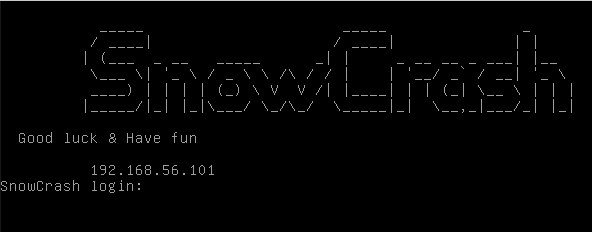

# Snowcrash

This project is an introduction to computer security. Snow Crash will make you discover security in various sub-domains, with a developer-oriented approach.

Snowcrash is a virtual machine from 42 School that goes through a variety of common (and less than common) weaknesses and vulnerabilities in Linux.

* SUID files
* Permissions
* Race conditions
* Shell meta-variables
* $PATH weaknesses
* Scripting language weaknesses
* Binary compilation failures

At the end, you will have a reasonably thorough understanding of local attacks against Linux systems, and a cursory look at some of the remote attacks that are possible.
